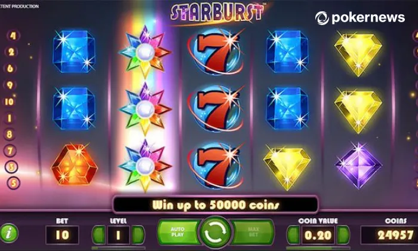
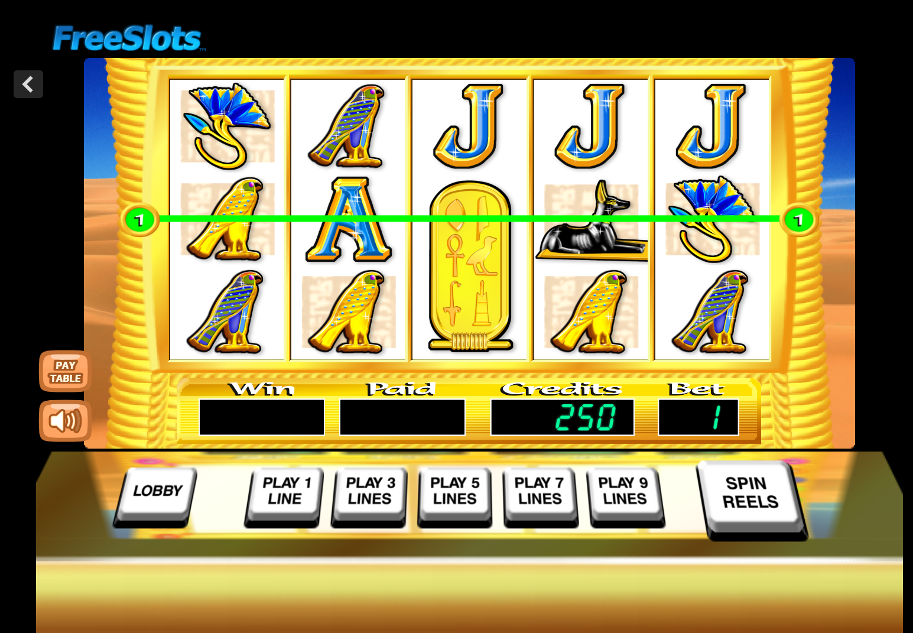
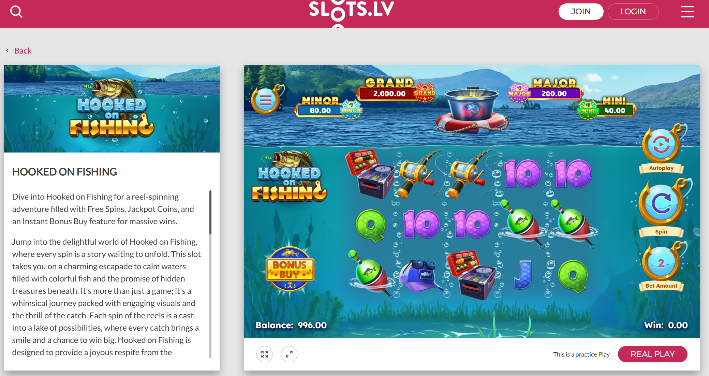

# General Research 

### Core Concept
- Slot machines are games of chance where players spin reels to match symbols and win payouts.
- Outcomes are determined by a **random number generator (RNG)**, ensuring randomness.
- Players bet money, spin, and receive rewards based on symbol combinations on **paylines**.

---

### Types of Slot / Related Games
- **Classic Slots**  3 reels, simple gameplay, limited features (e.g., fruit symbols, single payline).
- **Video Slots**  Digital slots with animations, multiple paylines, themes, and interactive bonus features.
- **Progressive Slots**  Jackpot increases over time as players contribute to a shared pool; can reach very large payouts.
- **Multi-line Slots**  Multiple paylines (horizontal, vertical, zig-zag) increase chances of winning combinations.
- **Multi-coin Slots**  Players can bet multiple coins per line to unlock higher payouts or bonus features.
- **Combination Slots**  Combine mechanics like multipliers, bonus rounds, and progressive jackpots.
- **Video Poker**  Players are dealt 5 cards and try to form the best poker hand; payouts depend on hand strength (e.g., pair, flush).
- **Video Bingo**  Instead of reels, players are assigned a digital bingo card (e.g., 5×5 grid) and outcomes are tied to bingo-style number draws behind the scenes.
- **Pachislo**  Japanese slot variant with 3 reels where players can manually stop each reel; includes timing/skill elements and higher player control compared to typical RNG slots.

---

### Key Features
- **Paylines**  Lines across reels where matching symbols create wins.
- **Bonus Rounds**  Extra games such as:
  - Free spins
  - Pick-and-win (choose hidden rewards)
  - Wheel spins
- **Multipliers**  Increase winnings based on bet size or special conditions.
- **Jackpots**
  - Fixed (flat) jackpots with consistent payouts
  - Progressive jackpots that grow over time
- **Themes**  Visual styles (casino, mythology, movies, fantasy, etc.)

---

### Gameplay & Mechanics
- **Reels**  Usually 3 or 5; can be mechanical (physical) or virtual (digital).
- **Betting System**  Players choose bet size and number of active paylines.
- **Denominations**  Range from low (penny slots) to high-stakes (dollars or more per spin).
- **Payout System**  Based on predefined probabilities calculated over many spins.

---

### Player Experience Factors
- **Visual Feedback**  Animations, flashing lights, and effects highlight wins.
- **Audio Feedback**  Sounds and music reinforce excitement and reward.
- **Frequent Small Wins**  Keeps players engaged even without large payouts.
- **Simplicity vs Complexity**
  - Simple interfaces for casual players
  - Advanced features for more experienced players

---

### Platforms
- **Land-based Slots**  Physical machines in casinos, bars, airports, etc.
- **Online Slots**  Web or mobile-based games with more features and accessibility.

---

### Important Concepts
- **RTP (Return to Player)**  Long-term percentage of money returned to players.
- **“Hot” vs “Cold” Machines**  Myth; outcomes are always random.
- **House Edge**  Built-in statistical advantage for the casino.

---

### Strategies slot machines use to keep people playing 

**Psychological Manipulation**
- Near-misses are programmed to show results just one symbol short of a win, triggering excitement and belief that a big win is coming
- Research shows near-misses activate the brain's reward system even without any actual payout
- The urge to keep playing after a near-miss can feel almost as strong as actually winning
- "Losses disguised as wins" machines celebrate payouts that are actually smaller than the original bet
- Players may believe they have a better chance of winning next time after a near-miss
- Fear of missing out players worry that if they stop, they'll miss their chance to win big

**Sensory Stimulation**
- Bright flashing lights and animations are tied directly to wins
- Celebratory sounds play even for small or net-negative payouts
- Audio and visual cues are deliberately paired together, which research shows specifically promotes risky decision-making
- Haptic feedback on touchscreen machines adds another sensory layer
- The combined sensory experience contributes to problem gambling behavior according to studies

**Abstraction of Money**
- Real cash is converted into digital credits upon insertion
- Machines pay out via voucher rather than coins or cash
- Credit displays replace dollar amounts, obscuring real spending
- These layers of abstraction make players lose track of actual losses
- It psychologically hurts less to lose credits than real money  until players cash out

**Familiar and Comfortable Themes**
- Machines are modeled after popular TV shows, movies, and games
- Examples include "Wheel of Fortune" and "Who Wants to Be a Millionaire" themed machines
- Familiar concepts lower players' guards and make them feel comfortable
- Themed visuals reduce hesitation and encourage longer play sessions
- Familiarity makes even complicated machines feel approachable

**Game Design and Pacing**
- Fast spin speeds minimize time between bets
- Autoplay removes the need for active decision-making, keeping play continuous
- Skip animations reduce friction between rounds
- Bet-max buttons encourage higher stakes with a single tap
- Multiple paylines give players the feeling of more chances to win
- Bonus rounds and free spins create additional engagement loops
- Progressive jackpots that grow over time incentivize continued play
- Small, frequent payouts create the illusion of winning even when the player is net negative
- No natural stopping points are built into the game

**Reward and Loyalty Systems**
- Loyalty points and player cards track and reward spending
- Tiered reward structures encourage chasing the next level
- Occasional bonus credits or free plays keep players coming back
- Rewards extend engagement beyond individual sessions
- Long-term hooks encourage players to return even after losses

## Types of slot machines examples

* Casino slot machines
  - Usually have a theme to the machine like pop culture. 

* Mobile game slot machines 

* Commputer based slot machines
  - [Basic free online slot games ](https://www.freeslots.com/) 
[Real online slot games (can be paid)](https://www.slots.lv/)

## Sources
* https://www.gamblingnerd.com/slots/types/
* https://www.gatewayfoundation.org/blog/casino-psychology/#:~:text=5.-,Near%2DMisses,five%20symbols%20needed%20to%20win.

